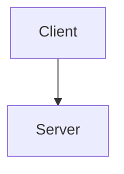

# Mermaid-Diagramme

Dieses Verzeichnis enthält **Mermaid-Diagramme** als textbasierte, versionierbare Alternative zu den SVG-Diagrammen im übergeordneten `diagrams/` Verzeichnis.

## Was ist Mermaid?

[Mermaid](https://mermaid.js.org/) ist eine JavaScript-basierte Diagramm- und Chart-Bibliothek, die Markdown-ähnliche Syntax verwendet, um Diagramme zu erstellen.

**Vorteile**:
- ✅ **Versionierbar**: Textbasiert, Git-freundlich
- ✅ **Einfach zu bearbeiten**: Keine Grafiksoftware nötig
- ✅ **Plattform-unabhängig**: Rendering in GitHub, GitLab, Confluence, VS Code, etc.
- ✅ **Wartbar**: Änderungen durch einfaches Text-Editing

## Verfügbare Diagramme

### 1a. `icis_oracle_forms_architektur_simplified.mmd` ⭐ Empfohlen für Präsentationen

**Typ**: Flowchart (Graph) mit Subgraphen - Vereinfacht  
**Quelle**: Abgeleitet von `diagrams/icis_oracle_forms_architektur.svg` und `context/icis_oracle_forms_architektur.md`  
**Beschreibung**: Oracle Forms 3-Tier-Architektur (Legacy ICIS-Klassik) - **Klare 3-Tier-Darstellung ohne interne Details**  
**Format**: Top-to-Bottom (TB) Flowchart  
**Orientierung**: Schnelles Verständnis, Workshop-Präsentationen

**Inhalt**:
- Client-Tier (Forms Java Client - Thin Client)
- Middle-Tier (WebLogic → Forms Runtime → ICIS Forms)
  - **Forms PL/SQL Execution**: Trigger, Program Units (ausgeführt im Forms Runtime)
- Database-Tier (Oracle Database mit SQL Engine + **Database PL/SQL Engine**)
  - **Database PL/SQL Execution**: Stored Procedures (BSP, DSP, GSP, TSP)
- **WICHTIG**: Zeigt zwei separate PL/SQL-Ausführungsumgebungen (Forms vs. Database)

**Verifiziert gegen**: Oracle Forms Services Architecture Documentation 14.1.2

**Use Cases**:
- Workshop Tag 1: Schnelle Erklärung der 3-Tier-Architektur
- Workshop Tag 2: Basis für Architektur-Diskussion
- Stakeholder-Präsentationen (nicht-technisches Publikum)

---

### 1b. `icis_oracle_forms_architektur.mmd` (Detailliert)

**Typ**: Flowchart (Graph) mit Subgraphen - Detailliert  
**Quelle**: Abgeleitet von `diagrams/icis_oracle_forms_architektur.svg` und `context/icis_oracle_forms_architektur.md`  
**Beschreibung**: Oracle Forms 3-Tier-Architektur (Legacy ICIS-Klassik) mit **internen Details**  
**Format**: Top-to-Bottom (TB) Flowchart  
**Orientierung**: Technische Diskussionen, Deep-Dive

**Inhalt**:
- Client-Tier (Forms Java Client)
- Application Server Tier (WebLogic, Forms Runtime, Oracle Forms Architecture **mit UI Presentation/Application Logic/Data Manager**)
  - **Forms PL/SQL Execution** (im Middle-Tier!): Forms Trigger, Program Units
- Database-Tier (Oracle Database, SQL Engine, Database PL/SQL Engine, DB-Komponenten, Service Procedures)
  - **Database PL/SQL Execution** (im Database-Tier): Stored Procedures (BSP, DSP, GSP, TSP)
- **Zusätzlich**: Interne Oracle Forms Architecture (3 Layer im Middle-Tier)
- **Kritisch**: Farbcodierung unterscheidet Forms PL/SQL (orange) vs. Database PL/SQL (blau)

**Verifiziert gegen**: Oracle Forms Services Architecture Documentation 14.1.2

**Use Cases**:
- Workshop Tag 1 (ICIS Deep Dive): Detailliertes Verständnis der Forms-Interna
- Workshop Tag 2: Technische Machbarkeitsanalyse
- Entwickler-Dokumentation

---

### 2. `icis_modern_architecture_c4.mmd`

**Typ**: C4 Container Diagram  
**Quelle**: Konzeptionell basierend auf geplanter Modernisierung  
**Beschreibung**: Ziel-Architektur nach Modernisierung (React/Angular + Spring Boot + Oracle DB)  
**Format**: C4 Model Level 2 (Container Diagram)  
**Orientierung**: Strategische Architektur-Diskussion

**Inhalt**:
- Personen: Sachbearbeiter (Power User), Kunde (End User)
- Frontend-Container: React/Angular Web App, Mobile App
- Backend-Container: Spring Boot API (Integration Layer), AI Gateway
- Datenbank-Container: Oracle Database (PL/SQL Services)
- Externe Systeme: SAP, COR Life, GDV, DMS

**Use Cases**:
- Workshop Tag 2: Entwurf Architekturdiagramm (Ziel-Architektur)
- Workshop Tag 2: Diskussion Integrationsschicht & Deployment
- Langfristige Architektur-Dokumentation

---

## Verwendung

### Rendering in GitHub/GitLab

Mermaid-Diagramme werden automatisch in GitHub/GitLab gerendert:

```markdown

\`\`\`
```

### Rendering in VS Code

Installieren Sie die Extension: **Markdown Preview Mermaid Support** oder **Mermaid Preview**

### Online-Editor

Besuchen Sie: https://mermaid.live/ für interaktives Bearbeiten und Exportieren

### Export zu PNG/SVG

**Mit Mermaid CLI**:
```bash
npm install -g @mermaid-js/mermaid-cli
mmdc -i icis_oracle_forms_architektur.mmd -o icis_oracle_forms_architektur.png
```

**Mit Online-Editor**: https://mermaid.live/ → Export als PNG/SVG

---

## Konventionen

### Dateinamen

- **Format**: `<thema>.mmd`
- **Beispiel**: `icis_oracle_forms_architektur.mmd`
- **Wenn abgeleitet von SVG**: Gleicher Dateiname wie SVG, nur `.mmd` statt `.svg`

### Kommentare in Mermaid

```mermaid
%% Dies ist ein Kommentar
%% Quelle: diagrams/icis_oracle_forms_architektur.svg
%% Autor: Sócrates Ponce (codecentric)
%% Datum: 2026-04-16
```

### Versionierung

- Alle `.mmd`-Dateien sollten in Git eingecheckt werden
- Änderungen in Commit-Nachrichten dokumentieren
- Bei größeren Umbauten: Kommentar im Diagramm mit Änderungsdatum

---

## Beziehung zu anderen Verzeichnissen

**Quell-Diagramme (SVG)**:
- Verzeichnis: `diagrams/` (übergeordnet)
- Typ: Original-Diagramme (oft von WGV oder mit Grafiksoftware erstellt)
- Format: SVG, PNG

**Interpretationen (Markdown)**:
- Verzeichnis: `context/`
- Typ: Textuelle Erklärungen der Diagramme
- Format: Markdown (`.md`)

**Mermaid-Diagramme (dieses Verzeichnis)**:
- Verzeichnis: `diagrams/mermaid/`
- Typ: Textbasierte, versionierbare Diagramme (oft abgeleitet von SVG oder neu erstellt)
- Format: Mermaid (`.mmd`)

**Workflow**:
1. Original-Diagramm (SVG) → `diagrams/`
2. Interpretation (Markdown) → `context/`
3. Mermaid-Version (optional, für Versionierung/Wartbarkeit) → `diagrams/mermaid/`

---

## Weiterführende Links

- **Mermaid Dokumentation**: https://mermaid.js.org/
- **Mermaid Live Editor**: https://mermaid.live/
- **C4 Model**: https://c4model.com/
- **Mermaid C4 Syntax**: https://mermaid.js.org/syntax/c4.html

---

## Änderungshistorie

### 2026-04-16 (Version 1.1) - Korrektur basierend auf Oracle-Dokumentation

**Änderungen**:
- ✅ **Korrigiert**: Klarstellung zwischen **Forms PL/SQL** (Middle-Tier) und **Database PL/SQL** (Database-Tier)
- ✅ **Verifiziert**: Gegen offizielle Oracle Forms Services Architecture Documentation 14.1.2
- ✅ **Hinzugefügt**: Farbcodierung in Diagrammen (orange = Forms PL/SQL, blau = Database PL/SQL)
- ✅ **Aktualisiert**: Beide Versionen (simplified & detailed) mit korrekter PL/SQL-Execution-Darstellung

**Quelle der Korrektur**: 
- Oracle Documentation: https://docs.oracle.com/en/middleware/developer-tools/forms/14.1.2/working-forms/oracle-forms-services-architecture.html
- Relevantes Zitat: "runs any PL/SQL in the form; executes triggers" (Forms Runtime Process)

**Wichtig**: Diese Korrektur ist kritisch für das Verständnis der Modernisierungsstrategie:
- Forms PL/SQL (Trigger, Program Units) muss migriert werden (→ Frontend/Backend)
- Database PL/SQL (Stored Procedures) bleibt erhalten

### 2026-04-16 (Version 1.0) - Initiale Erstellung

**Erstellt**: 2026-04-16  
**Autor**: Sócrates Ponce (codecentric)  
**Zweck**: Dokumentation der Mermaid-Diagramme für WGV ICIS Modernisierung
